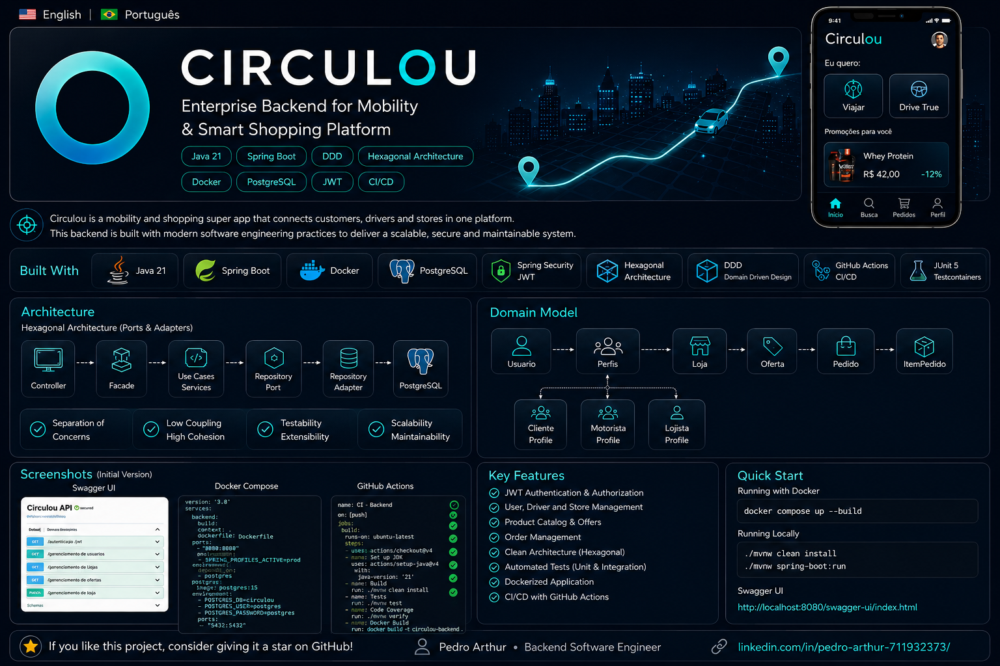

<p align="center">
  
</p>

# 🚀 Circulou Backend

## Enterprise-grade backend built with Java 21

> Corporate backend developed with **Java 21** and **Spring Boot**, following **Hexagonal Architecture**, **Domain-Driven Design (DDD)** and **SOLID** principles.

Circulou is a modern mobility and smart shopping platform designed using enterprise software engineering practices.

This project demonstrates real-world backend architecture, including Hexagonal Architecture, Domain-Driven Design (DDD), JWT Authentication, Docker, PostgreSQL, Testcontainers, GitHub Actions and production-oriented design principles.

---

## 📌 Project Overview

Circulou connects customers, drivers and stores through a single platform, enabling intelligent shopping and mobility experiences.

The backend is designed to support:

- Customer Management
- Driver Management
- Store Management
- Product Catalog
- Commercial Offers
- Order Management
- Secure Authentication
- Future Payment Integration
- Cloud Scalability

---

## 🏗 Architecture

The project follows **Hexagonal Architecture (Ports & Adapters)** combined with **Domain-Driven Design (DDD)**.

### Main Benefits

- Separation of Concerns
- Low Coupling
- High Cohesion
- Testability
- Scalability
- Maintainability

---

## ⚙️ Technology Stack

- Java 21
- Spring Boot
- Spring Security
- JWT Authentication
- Spring Data JPA
- PostgreSQL
- Maven
- Docker
- Testcontainers
- JUnit 5
- Mockito
- JaCoCo
- GitHub Actions
- Swagger / OpenAPI

---

## 🔒 Security

Implemented features:

- JWT Authentication
- BCrypt Password Hashing
- Stateless Security
- Bean Validation
- Global Exception Handling

---

## 🧪 Quality

Current quality standards include:

- Unit Tests
- Integration Tests
- Testcontainers
- JaCoCo Coverage
- Maven Build Validation

Every push is automatically validated using GitHub Actions.

---

## 🐳 Running with Docker

```bash
docker compose up --build
```

---

## ▶ Running Locally

Requirements:

- Java 21
- Maven
- PostgreSQL

Clone:

```bash
git clone https://github.com/circulousuperapp-art/circulou-backend.git
```

Run:

```bash
./mvnw spring-boot:run
```

---

## 🧪 Running Tests

```bash
./mvnw test
```

---

## 📖 API Documentation

Swagger UI

```
http://localhost:8080/swagger-ui/index.html
```

---

## 📄 License

This project is being developed as a professional portfolio and learning project.

---

## 👤 Author

**Pedro Arthur**

Backend Software Engineer

LinkedIn:

https://www.linkedin.com/in/pedro-arthur-711932373/