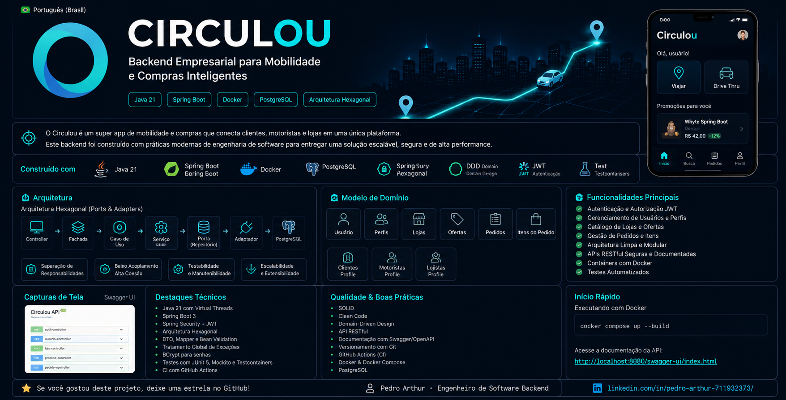

<p align="center">
  
</p>

# 🚀 Circulou Backend

## Backend corporativo desenvolvido com Java 21

> Backend corporativo desenvolvido com **Java 21** e **Spring Boot**, utilizando **Arquitetura Hexagonal**, **Domain-Driven Design (DDD)** e princípios **SOLID**.

O Circulou é uma plataforma moderna de mobilidade e compras inteligentes desenvolvida utilizando práticas de engenharia de software voltadas para aplicações corporativas.

Este projeto demonstra uma arquitetura backend real, utilizando Arquitetura Hexagonal, DDD, autenticação JWT, Docker, PostgreSQL, Testcontainers, GitHub Actions e princípios voltados para ambientes de produção.

---

## 📌 Visão Geral do Projeto

O Circulou conecta clientes, motoristas e lojas em uma única plataforma, oferecendo uma experiência inteligente de mobilidade e compras.

O backend foi projetado para suportar:

- Gestão de Clientes
- Gestão de Motoristas
- Gestão de Lojistas
- Catálogo de Produtos
- Ofertas Comerciais
- Gestão de Pedidos
- Autenticação Segura
- Integração futura com meios de pagamento
- Escalabilidade para ambientes em nuvem

---

## 🏗 Arquitetura

O projeto segue os princípios da **Arquitetura Hexagonal (Ports & Adapters)** combinada com **Domain-Driven Design (DDD)**.

### Principais Benefícios

- Separação de responsabilidades
- Baixo acoplamento
- Alta coesão
- Facilidade de testes
- Escalabilidade
- Facilidade de manutenção

---

## ⚙️ Tecnologias

- Java 21
- Spring Boot
- Spring Security
- JWT Authentication
- Spring Data JPA
- PostgreSQL
- Maven
- Docker
- Testcontainers
- JUnit 5
- Mockito
- JaCoCo
- GitHub Actions
- Swagger / OpenAPI

---

## 🔒 Segurança

Recursos implementados:

- Autenticação JWT
- Criptografia BCrypt
- Segurança Stateless
- Bean Validation
- Tratamento Global de Exceções

---

## 🧪 Qualidade

O projeto possui:

- Testes Unitários
- Testes de Integração
- Testcontainers
- Cobertura JaCoCo
- Validação de Build com Maven

Todo push é validado automaticamente através do GitHub Actions.

---

## 🐳 Executando com Docker

```bash
docker compose up --build
```

---

## ▶ Executando Localmente

Pré-requisitos:

- Java 21
- Maven
- PostgreSQL

Clone o repositório:

```bash
git clone https://github.com/circulousuperapp-art/circulou-backend.git
```

Execute:

```bash
./mvnw spring-boot:run
```

---

## 🧪 Executando os Testes

```bash
./mvnw test
```

---

## 📖 Documentação da API

Swagger UI

```
http://localhost:8080/swagger-ui/index.html
```

---

## 📄 Licença

Este projeto está sendo desenvolvido como portfólio profissional e projeto de aprendizado.

---

## 👤 Autor

**Pedro Arthur**

Backend Software Engineer

LinkedIn:

https://www.linkedin.com/in/pedro-arthur-711932373/